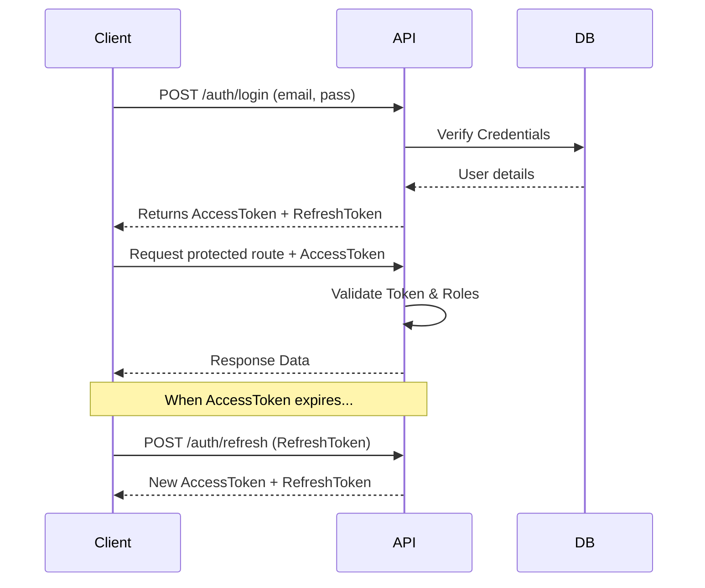

# CareConnect - Hospital & Clinic Appointment Management System

A production-quality, full-stack Hospital Management System built with Java Spring Boot and React, emphasizing clean architecture, role-based authorization, and modern UI design.

## 🚀 Features

*   **Role-Based Access Control (RBAC):** Strict isolation between Admin, Doctor, and Patient roles.
*   **Clean Architecture:** Backend structured in layers (Controller -> DTO -> Service -> Repository) adhering to SOLID principles.
*   **Stateless Authentication:** JWT-based authentication with refresh tokens.
*   **Data Seeding:** Automatically seeds database on startup using `DataFaker` with realistic mock data (Doctors, Patients, Appointments).
*   **Modern Frontend:** Premium glassmorphism UI built with React, Tailwind CSS, and Zustand.
*   **API Documentation:** Integrated Swagger UI for easy endpoint testing.

## 🏗️ Architecture

```mermaid
graph TD
    UI[React Frontend] --> |REST API / JWT| C[Spring Controllers]
    C --> |DTOs| S[Services & Business Logic]
    S --> |Entities| R[Spring Data Repositories]
    R --> DB[(PostgreSQL)]
    
    subgraph Security
        AuthFilter[JWT Auth Filter] --> C
        S -.-> |@PreAuthorize| AuthFilter
    end
```

## 🔒 JWT Authentication Flow



## 👥 Demo Credentials

The database is seeded with mock data on the first run. You can log in using the following accounts:

| Role | Email | Password |
| :--- | :--- | :--- |
| **Admin** | `admin@hospital.com` | `Admin@123` |
| **Doctor** | `doctor1@hospital.com` | `Doctor@123` |
| **Patient** | `patient1@hospital.com` | `Patient@123` |

## 🛠️ Setup & Run

### Prerequisites
* Docker and Docker Compose

### Starting the Application
Simply run the following command in the root directory:
```bash
docker compose up -d
```

* **Frontend UI:** `http://localhost:3000`
* **Backend API Docs (Swagger):** `http://localhost:8080/swagger-ui.html`

## 📁 Folder Structure

```
appointment-app/
├── backend/                  # Java Spring Boot application
│   ├── src/main/java/com/hospital/appointment_system
│   │   ├── config/           # Swagger & Security config
│   │   ├── controller/       # REST Controllers
│   │   ├── dto/              # Data Transfer Objects
│   │   ├── entity/           # JPA Entities
│   │   ├── exception/        # Global Exception Handlers
│   │   ├── mapper/           # MapStruct Interfaces
│   │   ├── repository/       # Data Access Layer
│   │   ├── security/         # JWT Utils & Filters
│   │   ├── service/          # Business Logic
│   │   └── util/             # Data Seeder
├── frontend/                 # React (Vite) application
│   ├── src/
│   │   ├── components/       # Shared UI components
│   │   ├── layouts/          # Dashboard & Auth layouts
│   │   ├── pages/            # Role-specific views
│   │   ├── services/         # Axios interceptors & API logic
│   │   └── store/            # Zustand global state
└── docker-compose.yml        # Infrastructure orchestration
```

## 🛡️ Security Implementation Details

Security is heavily prioritized in this architecture:
*   **No Direct Entity Exposure:** All endpoints strictly accept and return DTOs mapped via MapStruct.
*   **Service-Level Ownership Checks:** `DoctorService` and `PatientService` actively query the database to ensure a user only mutates records belonging to them.
    *   *Example:* `doctorService.deleteAvailability(userId, slotId)` validates the `slot` belongs to the `userId`.
*   **Method Security:** `@PreAuthorize("hasRole('...')")` prevents unauthorized roles from hitting controller/service methods.
*   **Refresh Tokens:** Secured rotation of tokens managed via a DB table with expiration dates.
